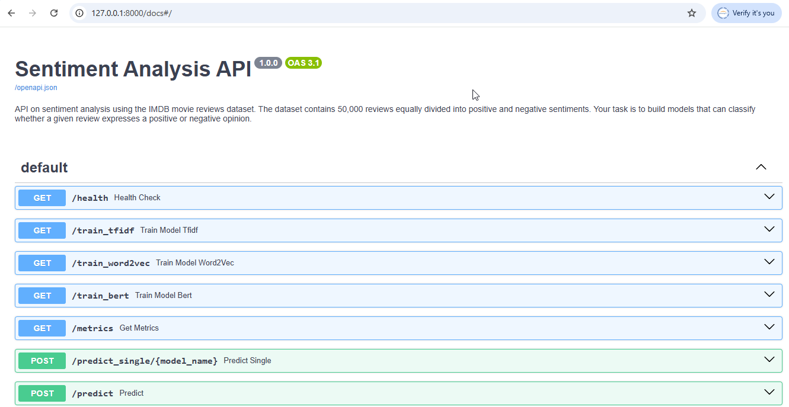

# 📝 Sentiment Analysis Project

This project implements a **Sentiment Analysis system** using Python, FastAPI, and machine learning models.  
It includes training scripts, model persistence, and an API server for serving predictions.

---

## 📂 Project Structure
```
SENTIMENT-ANALYSIS/
│
├── app/                       # Main application package
│   ├── __pycache__/           # Python cache files (auto-generated)
│   ├── config.py              # Configurations (seeds, constants, device setup)
│   ├── main.py                # Entry point for FastAPI/Flask app
│   ├── model_io.py            # Model save/load utilities
│   ├── model_train.py         # Training pipeline (preprocessing + training)
│   ├── utils.py               # Helper functions
│
├── models/                    # Trained model files (saved .pt / .pkl)
│
├── venv/                      # Virtual environment (not to be committed to Git)
│   ├── Include/
│   ├── Lib/
│   ├── Scripts/
│   ├── share/
│   └── pyvenv.cfg
│
├── README.md                  # Documentation for the project
├── requirements.txt           # Python dependencies
├── run_server.py              # Script to run API server


## 🛠 Installation & Local Development
### 1. Prerequisites
- Python 3.12.10
- pip (Python package manager)
### 2. Clone the repository
git clone https://github.com/debbrath/Sentiment-Analysis.git
cd Sentiment-Analysis
### 3. Create and activate a virtual environment
# On Windows PowerShell
python -m venv venv
# Set-ExecutionPolicy -ExecutionPolicy RemoteSigned -Scope CurrentUser
venv\Scripts\activate

# On Linux/Mac
python -m venv env
source env/bin/activate
### 4. Install dependencies
pip install -r requirements.txt
### 5. Train the model (if not already trained)
 
(venv) PS F:\Python\Sentiment-Analysis> python -m app.model_train 

### 6. Run locally
(venv) PS F:\Python\Sentiment-Analysis> uvicorn app.main:app –reload
 



📡 API Usage

Endpoint: POST /predict

Input JSON:

{
  "text": "I love this product!"
}


Output JSON:

{
  "sentiment": "positive"
}

🛠 Technologies Used

Python 3.9+

FastAPI – API framework

PyTorch / Scikit-learn – Model training

Pandas / NumPy – Data processing

📌 To Do

 Add dataset folder and preprocessing scripts

 Improve error handling in API

 Add evaluation metrics visualization

 Deploy to Render/Heroku/Docker
